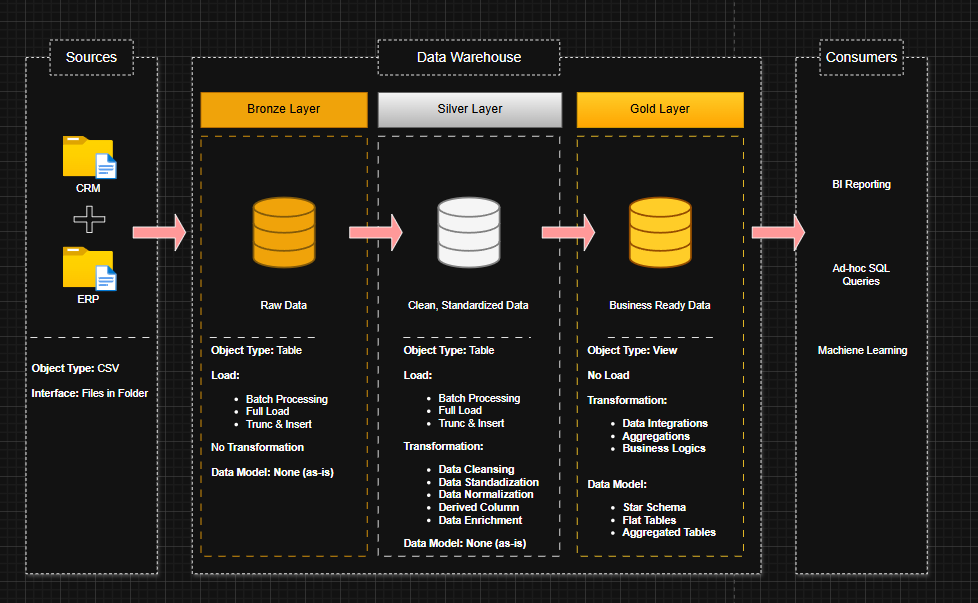
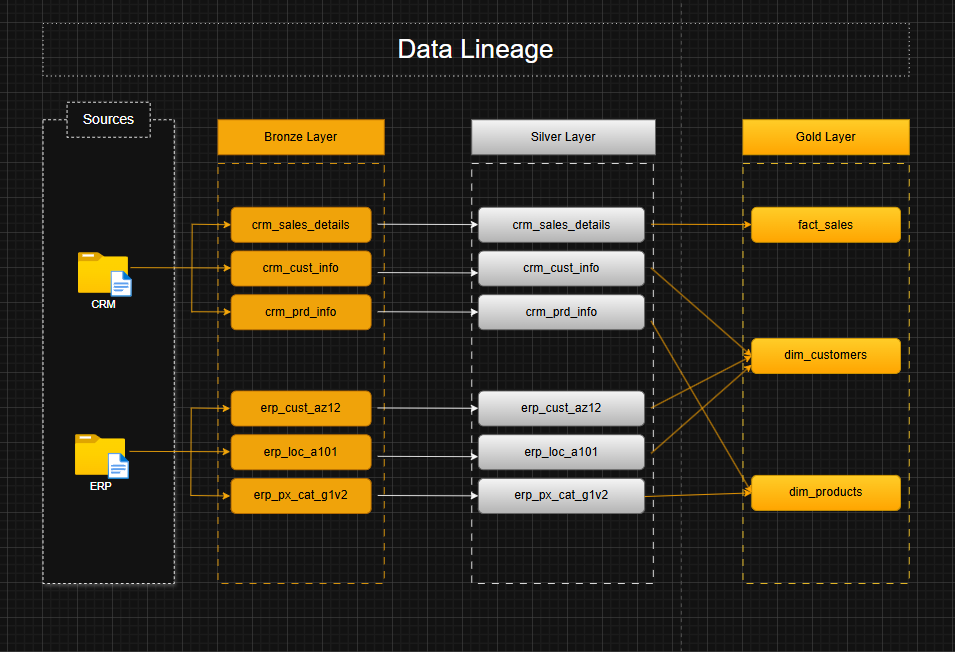

# 📊 Data Warehouse & Analytics Project

Welcome to the **Data Warehouse & Analytics Project** repository! 🚀  
This project demonstrates a complete end-to-end data warehousing and analytics workflow — from ingesting raw source files to delivering business-ready insights. Built as a portfolio project, it highlights modern data engineering practices, data modeling, and analytical reporting techniques.

---

## 🏗️ Data Architecture

This solution follows the **Medallion Architecture**, organizing data into progressive refinement layers: **Bronze**, **Silver**, and **Gold**.

---

## 📈 Data Flow Diagram

The following diagram illustrates the end-to-end flow of data from raw source files through the Bronze, Silver, and Gold layers, showing how data is ingested, transformed, and prepared for analytics.

---

### 🥉 Bronze Layer — Raw Data
- Stores data exactly as received from source systems  
- Ingests CSV files into SQL Server  
- No transformations applied  
- Acts as the raw source of truth  

### 🥈 Silver Layer — Refined Data
- Cleansed, standardized, and validated data  
- Handles data quality fixes, normalization, and enrichment  
- Structured for downstream analytical workflows  

### 🥇 Gold Layer — Business Layer
- Contains business-ready datasets  
- Star-schema modeled fact and dimension tables  
- Supports BI dashboards, SQL analytics, and ML workloads  

---

## 📖 Project Overview

This repository includes:

### ✔️ Data Architecture  
Design and implementation of a modern SQL-based data warehouse using the Medallion approach.

### ✔️ ETL / ELT Pipelines  
Scripts for extracting, transforming, and loading data from ERP and CRM CSV files into SQL Server.

### ✔️ Data Modeling  
Creation of analytical fact and dimension tables optimized for reporting.

### ✔️ Analytics & Reporting  
SQL queries and reporting components that turn data into actionable insights.

---

## 🛠️ Tools & Resources

- **[Datasets](datasets/)** – Source CSV files used in the project  
- **[SQL Server Express](https://www.microsoft.com/en-us/sql-server/sql-server-downloads)** – Database engine  
- **[SQL Server Management Studio (SSMS)](https://learn.microsoft.com/en-us/sql/ssms/download-sql-server-management-studio-ssms)** – SQL development & administration tool  
- **[GitHub](https://github.com/)** – Version control and collaboration  
- **[DrawIO](https://www.drawio.com/)** – Used for designing data models and architecture diagrams  

---

### 🎯 Objective
Build a modern SQL Server–based data warehouse to integrate and prepare sales data for analytics and reporting.

### 📌 Specifications
- **Data Sources**: ERP and CRM systems (CSV formats)  
- **Data Quality**: Clean and standardize data before loading  
- **Integration**: Merge both sources into a single unified model  
- **Modeling**: Develop a well-documented star schema  
- **Scope**: Focused on the latest dataset (no historization required)  
- **Documentation**: Provide user-friendly data model explanations  

---

## 🛡️ License

This project is licensed under the **MIT License**.  
You are free to use, modify, and distribute it with attribution.

---

## 🌟 About Me

Hi! I'm **Jatin Srivastava**, a Data Analyst and Power BI Developer with strong expertise in SQL, data modeling, and business intelligence.  
I enjoy designing efficient data pipelines, developing scalable BI solutions, and applying modern data engineering concepts to solve real-world business problems.

Let’s connect!

