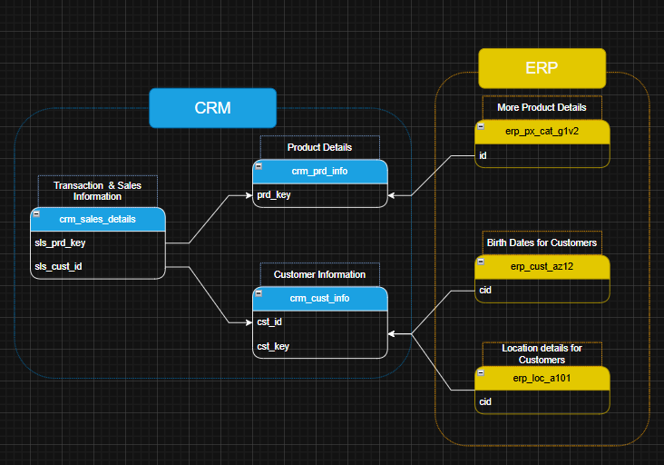

# 📊 Data Warehouse & Analytics Project

Welcome to the **Data Warehouse & Analytics Project** repository! 🚀  
This project demonstrates a complete end-to-end data warehousing and analytics workflow — from ingesting raw source files to delivering business-ready insights. Built as a portfolio project, it highlights modern data engineering practices, data modeling techniques, and analytical reporting.

---

## 🏗️ Data Architecture

This solution follows the **Medallion Architecture**, organizing data into progressive refinement layers: **Bronze**, **Silver**, and **Gold**.


---

## 📈 Data Flow Diagram

This diagram illustrates the end-to-end data movement across the warehouse — showing how raw source files are ingested, cleaned, transformed, and delivered as analytical-ready datasets.


---

## 🔄 Data Integration Diagram

This diagram shows how CRM and ERP datasets connect using shared business keys. CRM provides customer, product, and sales information, while ERP contributes additional customer demographics, product attributes, and location details.  
Both systems feed into the Silver layer to create a unified and standardized view for downstream analytics.



---

### 🥉 Bronze Layer — Raw Data

- Stores data exactly as received from source systems
- Ingests CSV files into SQL Server
- No transformations applied
- Acts as the raw source of truth

### 🥈 Silver Layer — Refined Data

- Cleansed, standardized, and validated data
- Handles data quality fixes, normalization, and enrichment
- Structured for downstream analytical workflows

### 🥇 Gold Layer — Business Layer

- Contains business-ready datasets
- Star-schema modeled fact and dimension tables
- Supports BI dashboards, SQL analytics, and ML workloads

---

## 📊 Gold Layer Star Schema (Model)

This diagram illustrates the Gold Layer star schema created as part of this project.  
It consists of:

- **gold.fact_sales** — Sales transactional dataset
- **gold.dim_customers** — Customer attributes
- **gold.dim_products** — Product attributes


---

## 📖 Project Overview

This repository includes the following components:

### ✔️ Data Architecture

Design and implementation of a modern SQL-based data warehouse using the Medallion approach.

### ✔️ ETL / ELT Pipelines

Scripts for extracting, transforming, and loading data from ERP and CRM CSV files into SQL Server.

### ✔️ Data Modeling

Star schema design with analytical fact and dimension tables optimized for reporting.

### ✔️ Analytics & Reporting

SQL queries and BI outputs that generate actionable insights.

---

## 📁 Project Folder Structure

```bash
├── datasets/
│   ├── source_crm/
│   │   ├── cust_info.csv
│   │   ├── prd_info.csv
│   │   └── sales_details.csv
│   │
│   ├── source_erp/
│   │   ├── CUST_AZ12.csv
│   │   ├── LOC_A101.csv
│   │   └── PX_CAT_G1V2.csv
│
├── docs/
│   ├── data_architecture.png
│   ├── data_flow.png
│   ├── data_integration_model.png
│   ├── data_model_diagram.png
│   └── gold_data_catalog.md
│
├── scripts/
│   ├── bronze/
│   │   ├── 03_ddl_bronze_tables.sql
│   │   └── 04_sp_bronze_data_load.sql
│   │
│   ├── silver/
│   │   ├── 05_ddl_silver_tables.sql
│   │   ├── 06_silver_data_load.sql
│   │   └── 07_silver_data_profiling.sql
│   │
│   ├── gold/
│   │   └── 08_ddl_gold_views.sql
│   │
│   ├── 01_init_database.sql
│   └── 02_db_schema.sql
│
├── LICENSE
└── README.md
```

---

## 🛠️ Tools & Resources

- **[Datasets](datasets/)** – Source CSV files used in the project
- **[SQL Server Express](https://www.microsoft.com/en-us/sql-server/sql-server-downloads)** – Database engine
- **[SQL Server Management Studio (SSMS)](https://learn.microsoft.com/en-us/sql/ssms/download-sql-server-management-studio-ssms)** – SQL development & administration tool
- **[GitHub](https://github.com/)** – Version control and collaboration
- **[DrawIO](https://www.drawio.com/)** – Used for designing data models and architecture diagrams

---

## 🎯 Objective

Build a modern SQL Server–based data warehouse to integrate and prepare sales data for analytics and reporting.

---

## 📌 Specifications

- **Data Sources**: ERP and CRM systems (CSV format)
- **Data Quality**: Clean and standardize data before loading
- **Integration**: Merge both systems into a unified analytical model
- **Modeling**: Build a fact-dimension star schema
- **Scope**: Focus on latest dataset (no historization)
- **Documentation**: Includes diagrams, data catalogs, and explanations

---

## 📁 Additional Documentation

- **[Gold Layer Data Catalog](docs/gold_data_catalog.md)** – Detailed table and column-level documentation
- Scripts for Bronze, Silver, and Gold layers available in the `scripts/` directory

---

## 🛡️ License

This project is licensed under the **MIT License**.  
You are free to use, modify, and distribute it with attribution.

---

## 🌟 About Me

Hi! I'm **Jatin Srivastava**, a Data Analyst and Power BI Developer with strong expertise in SQL, data modeling, and business intelligence. I enjoy designing efficient data pipelines, developing scalable BI solutions, and applying modern data engineering concepts to solve real-world business challenges.

Let’s connect!

[](https://www.linkedin.com/in/jatin-srivastava-702b9118a/)
