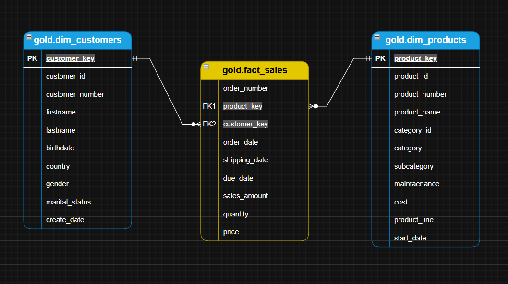

# 📘 Gold Layer Data Catalog

The Gold Layer contains business-ready dimension and fact views modeled using a **Star Schema**.

---

## 📊 Gold Layer Star Schema

---

# ⭐ gold.dim_customers

### Description

Customer dimension containing enriched and standardized customer information for analytics.

### Primary Key

- `customer_key`

### Columns

| Column Name     | Data Type    | Description                                                      |
| --------------- | ------------ | ---------------------------------------------------------------- |
| customer_key    | INT          | Surrogate primary key used for joining with fact tables.         |
| customer_id     | INT          | Source system customer ID.                                       |
| customer_number | NVARCHAR(50) | Business customer identifier/code.                               |
| firstname       | NVARCHAR(50) | Standardized customer first name.                                |
| lastname        | NVARCHAR(50) | Standardized customer last name.                                 |
| birthdate       | DATE         | Customer birth date, formatted as YYYY-MM-DD (e.g., 1998-06-18). |
| country         | NVARCHAR(50) | The Country of residence of the customer (e.g., 'India').        |
| gender          | NVARCHAR(50) | Standardized gender value (e.g.,'Male', 'Female').               |
| marital_status  | NVARCHAR(50) | Customer marital status (e.g.,'Single', 'Married').              |
| create_date     | DATE         | Source system record creation date.                              |

---

# ⭐ gold.dim_products

### Description

Product dimension with core and extended product attributes, used for product-level analytics.

### Primary Key

- `product_key`

### Columns

| Column Name    | Data Type    | Description                                                                                 |
| -------------- | ------------ | ------------------------------------------------------------------------------------------- |
| product_key    | INT          | Surrogate key for the product dimension.                                                    |
| product_id     | INT          | Original product ID from CRM/ERP.                                                           |
| product_number | NVARCHAR(50) | Product catalog or internal reference number.                                               |
| product_name   | NVARCHAR(50) | Cleaned and standardized product name.                                                      |
| category_id    | NVARCHAR(50) | A unique identifier for the product's category, linking to its high-level classification.   |
| category       | NVARCHAR(50) | The broader classification of the product (e.g., Bikes, Components) to group related items. |
| subcategory    | NVARCHAR(50) | A more detailed classification of the product within the category, such as product type.    |
| maintenance    | NVARCHAR(50) | Indicates whether the product requires maintenance (e.g., 'Yes', 'No').                     |
| cost           | INT          | Standard cost of the product.                                                               |
| product_line   | NVARCHAR(50) | The specific product line or series to which the product belongs (e.g., Road, Mountain).    |
| start_date     | DATE         | The date when the product became available for sale or use, stored in                       |

---

# ⭐ gold.fact_sales

### Description

Fact table capturing sales transactions with foreign keys linking to Product and Customer dimensions.

### Foreign Keys

- `product_key` → gold.dim_products
- `customer_key` → gold.dim_customers

### Columns

| Column Name   | Data Type    | Description                                     |
| ------------- | ------------ | ----------------------------------------------- |
| order_number  | NVARCHAR(50) | Unique identifier for each order/transaction.   |
| product_key   | INT          | Foreign key referencing the Product dimension.  |
| customer_key  | INT          | Foreign key referencing the Customer dimension. |
| order_date    | DATE         | Date when the order was placed.                 |
| shipping_date | DATE         | Date when the order was shipped.                |
| due_date      | DATE         | Delivery or payment due date.                   |
| sales_amount  | INT          | Total monetary value of the sales transaction.  |
| quantity      | INT          | Number of units sold.                           |
| price         | INT          | Unit price at the time of sale.                 |

---

# 🔗 Gold Layer Relationships (Star Schema)

| Fact Table | Dimension Table | Key          |
| ---------- | --------------- | ------------ |
| fact_sales | dim_customers   | customer_key |
| fact_sales | dim_products    | product_key  |

---
